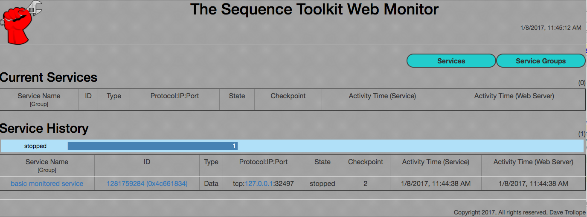

# Welcome to the Sequence Toolkit

The Sequence Toolkit (STK) is a middleware product for applications running in the cloud. Add STK to your applications and you'll gain :

* Improved fault detection from Intelligent Heartbeating (Smartbeat Technology)
* Web based Application Monitoring for improved cloud monitoring.
* Visibility in to Application State (Starting/Running/Stopped/Timed Out/Sending/<Application defined>...)
* Ability to react to application state changes
* Granular Application Monitoring through Services.
* Monitoring of Individual Applications/Services or Groups
* Fast Pub/Sub Messaging
* Service Monitoring for Python, Ruby, Java and C/C++ Applications
* State Change Notification and Registration in Python and C/C++ Applications

STK simplifies implementing software/application services and eases application monitoring.

This project has been open sourced from a private project and thus not all your typical install instructions exist yet.
It is developed in CLion and with custom makefiles for the alternative APIs but can also be built in-source
using more traditional methods... 
For building API bindings, see the README.md in the api directory - the following refers to the core library.

What follows are the traditional instructions which should work from the build dir of CLion or the root of an in-source build.

# Building STK (Quickstart)

cmake CMakeLists.txt
make

By default, cmake generates libraries and binaries in the cmake-build-debug dir.

For more detailed instructions see [BUILDING.txt](BUILDING.md)

# Tutorial/Examples

All these examples assume you have setup the environment to find the STK library (using system library dirs or LD_LIBRARY_PATH's etc.)
and the STK daemon (stkd) is running (found in the lib and daemons directories of your build tree).

## C/C++

Make sure you cd to the examples dir!

### Service Monitoring, State Management

Run './monitored_service -t 2'

    Davids-MacBook-Air:examples dave$ ./monitored_service -t 2
    data flow 0x7fca85500480 name server data flow for monitored_service[29091] to port 20002 connected (fd 3)
    data flow 0x7fca85402880 monitoring socket for monitored_service[29090] to port 20001 connected (fd 6)
    Monitoring channel created
    Using random service ID: 37089166
    The new value of x is 2
    The new value of x is 4
    The new value of x is 8
    Monitoring channel destroyed
    Monitoring channel destroyed
    basic monitored service hit its threshold of 2
    
This shows a dummy application which calculated the value of 'x' which is connected to the STK daemon for monitoring.
Visiting http://localhost:8080 you will see:

This shows the basic service started and is now stopped and the Checkpoint was last at 2 - this was the threshold
specified with '-t 2' so the service clearly stopped as expected. :-)

Smartbeats carry the application state and checkpoints to the monitoring web service over a named pub/sub channel
which stores current and past state about applications.

### Pub/Sub

Here is an example of running a subscriber and then a publisher on a named channel in true pub/sub style.

(Scroll output left/right to compare subscribing and publishing in realtime)

<TABLE WIDTH=100%><TR>
<TH>Subscribe</TH><TH>Publish</TH>
</TR><TR>
<TD VALIGN=TOP><pre>
Davids-MacBook-Air:examples dave$ ./subscribe pubsub_test
Subscribing to 'pubsub_test'
data flow 0x7f80c6500380 name server data flow for subscribe[29091] to port 20002 connected (fd 5)
Received info on name pubsub_test, IP 127.0.0.1 Port 29312 Protocol tcp
set client socket receive buffer size on port 29312, env 0x7f80c6402780
data flow 0x7f80c6500510 tcp subscriber data flow[29090] to port 29312 connected (fd 6)
Adding df 0x7f80c6500510 fd 6 to dispatcher, count 0
Adding df 0x7f80c6500510 to data connection table, current size 0
Name pubsub_test has 6 meta data elements
Meta data type 1 sz 12
Meta data type 4 sz 4
Meta data type 2 sz 16
Meta data type 6 sz 4
Meta data type 7 sz 4
Meta data type 5 sz 8
Waiting to complete request
Dispatching
data flow 0x7f80c6500510: Number of elements in received sequence: 1 Sequence type: Data
Sequence 0x7f80c64028d0 Received 10 bytes of type 309
Bytes: 64 65 66 61 ... 74 20 de ad
Received: 1
data flow 0x7f80c6500510: Number of elements in received sequence: 1 Sequence type: Data
Sequence 0x7f80c64028d0 Received 10 bytes of type 309
Bytes: 64 65 66 61 ... 74 20 de ad
Received: 2
data flow 0x7f80c6500510: Number of elements in received sequence: 1 Sequence type: Data
Sequence 0x7f80c64028d0 Received 10 bytes of type 309
Bytes: 64 65 66 61 ... 74 20 de ad
Received: 3
...
data flow 0x7f80c6500510: Number of elements in received sequence: 1 Sequence type: Data
Sequence 0x7f80c65004d0 Received 10 bytes of type 309
Bytes: 64 65 66 61 ... 74 20 de ad
Received: 100
channel 2 deleted, fd 6
^CReceived SIGTERM/SIGINT, exiting...
Received: 100
./subscribe terminated
</pre></TD>
<TD VALIGN=TOP>
<pre>
               
Davids-MacBook-Air:examples dave$ ./publish pubsub_test
Publishing to 'pubsub_test'
Failed to set receive socket buffer size 16000000 on port 29312, env 0x7fcd09c02780 err 55 df 6
Received info on name pubsub_test, IP 127.0.0.1 Port 29312 Protocol tcp
Name pubsub_test has 2 meta data elements
Meta data type 5 sz 8
Meta data type 1 sz 12
Data on well known port
Adding df 0x7fcd09e001c0 fd 7 to data connection table, current size 0
Waiting to complete request
Request expired on name pubsub_test, 2 callbacks received
Waiting for connections
Something connected!
Sending 100 sequences
Send Interval (sent - start): 0.000769 secs (avg 7 usecs)
Total Interval (end - start): 0.000769 secs
Letting data flows drain
./publish ended: Sent 100 sequences
</pre></TD>
</TR></TABLE>

STK uses the term "Sequences" instead of "messages" for various reasons, 
but for simple cases they can be considered the same.

This example sends and receives 100 sequences.:

### Name Resolution, Named Meta-data Storage

Example of registering an IP address with a name (meta_data_registration) in a name group (test):

    Davids-MacBook-Air:examples dave$ ./simple_name_registration -i tcp:127.0.0.1:5432 -G test meta_data_registration
    data flow 0xfeb510 auto created data flow[0] to port 20002 connected (fd 3)
    Name Server connected, fd 3
    Registering info on name meta_data_registration
    Received info on name meta_data_registration, IP 0.0.0.0 Port 5432, FT State 0
    Request expired on name meta_data_registration, 2 callbacks received
    Received 2 sequences, waiting for 2
    Name Server disconnected, fd 3
    ./simple_name_registration: Received 2 name registration callbacks
    
    Davids-MacBook-Air:examples dave$ ./simple_name_lookup -G test meta_data_registration
    data flow 0x94c4b0 auto created data flow[0] to port 20002 connected (fd 3)
    Name Server connected
    Requesting info on name meta_data_registration
    Received info on name meta_data_registration, IP 127.0.0.1 Port 5432 Protocol tcp, FT State active
    Name meta_data_registration has 7 meta data elements
    Meta data type 1 sz 23
    Meta data type 4 sz 4
    Meta data type 3 sz 5
    Meta data type 2 sz 16
    Meta data type 6 sz 4
    Meta data type 7 sz 4
    Meta data type 5 sz 8
    Received 1 sequences, waiting for 2
    Request expired on name meta_data_registration, 2 callbacks received
    Received 2 sequences, waiting for 2
    Name Server disconnected
    name lookup of 'meta_data_registration' expired

Application defined meta data can be associated with a name too - its not just for IP addresses!

Note the very last line - name lookups have expiration built in and your application is notified when no more responses will be
received. This simplifies your application logic providing a deterministic end to your lookups. 

# Legal Notices
D3 (used in stkhttpd)

Copyright (c) 2013, Michael Bostock
All rights reserved.

Redistribution and use in source and binary forms, with or without
modification, are permitted provided that the following conditions are met:

* Redistributions of source code must retain the above copyright notice, this
  list of conditions and the following disclaimer.

* Redistributions in binary form must reproduce the above copyright notice,
  this list of conditions and the following disclaimer in the documentation
  and/or other materials provided with the distribution.

* The name Michael Bostock may not be used to endorse or promote products
  derived from this software without specific prior written permission.

THIS SOFTWARE IS PROVIDED BY THE COPYRIGHT HOLDERS AND CONTRIBUTORS "AS IS"
AND ANY EXPRESS OR IMPLIED WARRANTIES, INCLUDING, BUT NOT LIMITED TO, THE
IMPLIED WARRANTIES OF MERCHANTABILITY AND FITNESS FOR A PARTICULAR PURPOSE ARE
DISCLAIMED. IN NO EVENT SHALL MICHAEL BOSTOCK BE LIABLE FOR ANY DIRECT,
INDIRECT, INCIDENTAL, SPECIAL, EXEMPLARY, OR CONSEQUENTIAL DAMAGES (INCLUDING,
BUT NOT LIMITED TO, PROCUREMENT OF SUBSTITUTE GOODS OR SERVICES; LOSS OF USE,
DATA, OR PROFITS; OR BUSINESS INTERRUPTION) HOWEVER CAUSED AND ON ANY THEORY
OF LIABILITY, WHETHER IN CONTRACT, STRICT LIABILITY, OR TORT (INCLUDING
NEGLIGENCE OR OTHERWISE) ARISING IN ANY WAY OUT OF THE USE OF THIS SOFTWARE,
EVEN IF ADVISED OF THE POSSIBILITY OF SUCH DAMAGE.
